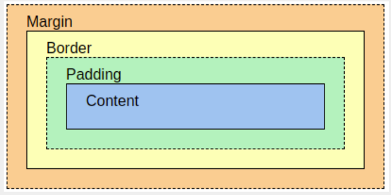

# CSS

#### Basic Rule

    selector {
        property: value;
        ...
    }

#### Selectors Indicate How

- Basic Tags, like "div", "h1", ...
- "." + Class Name, like ".class1", ".class2", ...
- "#" + ID, like "#1", "#2", ...

#### Properties

- color
- font-family
- font-size
- margin-block-start
- margin-block-end
- margin-inline-start
- margin-inline-end
- font-weight: bold
- text-align: center

Notice: Tags like \<h1> have some default styling while \
 and \ do not.

#### Combine HTML How

Add

    <link rel = "stylesheet" href = "style.css" />

inside the \<head> tag of the HTML file.

#### Naming Convention

Use "u-" to indicate utilities, like "u-textCenter".

#### Variables

Define

    :root {
        --variableName: value;
    }

Use

    .navTitle {
        color: var(--vName);
    }

#### The Box Model

Setting margin or padding be like:

    margin: 10px; -> 10px on all four sides
    margin: 10px 20px; -> 10, 20, 10, 20
    margin: 10px 20px 30px; -> 10, 20, 30, 20
    margin: 10px 20px 30px 40px; -> 10, 20, 30, 40

#### The Example: Rounding an Image

HTML

    

        

    

CSS

    .avatarContainer {
        padding: 0 35%;
    }

    .avatar {
        /* make it responsive */
        max-width: 100%;
        width: 100%;
        height: auto;
        display: block;
        /* div height to be the same as width*/
        padding-top: 100%;

        /* make it a circle */
        border-radius: 50%;

        /* Add image */
        background-image: url("cat.png");

        /* Centering on image`s center*/
        background-position-y: center;
        background-position-x: center;
        background-repeat: no-repeat;

        /* it makes the clue thing, takes smaller dimension to fill div */
        background-size: cover;

        /* it is optional, for making this div centered in parent*/
        margin: 0 auto;
    }

Note: The base value of the percentage is the value of the parent element.
Note: The parent element means the outer layer tag.

#### Flex

Initalizing

    display: flex;

Setting Direction

    flex-direction: row / column / row-reverse / column-reverse;

Setting Size, 

    flex-basis: **px; 
    flex-grow: 0/1/2/...

Notice: row is the default value of flex-direction.
Notice: flex-basis for fixed size, flex-grow for dynamically allocated sizes.