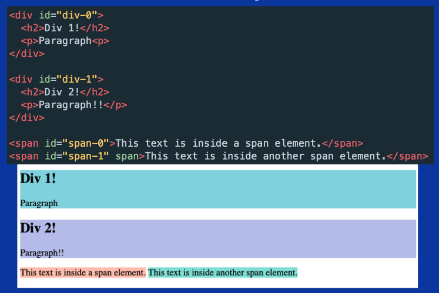

# HTML

#### Basic Tags
- \<html>: Root of HTML Document
- \<head>: Info about Document
- \<body>: Document Body
- \<h1>\<h2>\<h3>...: Header Tags
- \
: Paragraph Tag
- \
: Generic Block Section Tag
- \: Generic Inline Section Tag
- \<ol>: Ordered List
- \<ul>: Unordered List
  - \<li>: List Item
- \
: Dividing Line

#### HTML Attributes
    <tagname attriName = value>
e.g:

    <a href="http://weblab.mit.edu">
        Link to web.lab!
    </a>
e.g:

    

#### Div and Span

